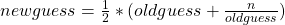

### 4.1. 定义 C++ 函数
> 通常我们可以通过函数来隐藏特定的计算细节。函数的定义包括函数名、一组函数参数、返回值类型以及函数体。返回值可以是一个变量、常量值或者是以 `void` 代表的空值。以下是一个函数定义的示例：
```cpp
#include <iostream>
using namespace std;

int timesTwo(int num) {
    return num*2;
}

int main() {
    cout << timesTwo(5) << endl;
    return 0;
}
```

> 以上的函数定义包含有：函数名 `timesTwo`、由括号包裹的函数参数（`num`）以及它的类型（`int`）。我们所隐藏的的“细节”就是 *计算 `num*2` 的值并返回它*。`timesTwo` 返回的整数另可以用于其他函数的调用（即 `cout`）。
```cpp
#include <iostream>
using namespace std;

void timesTwoVoid(int num) {
  cout << num*2 << endl;
}

int main() {
    timesTwoVoid(5);
    return 0;
}
```

> 以上函数 `timesTwoVoid` 与 `timesTwo` 唯一差别就是它们的类型声明：：`timesTwoVoid` 是一个不返回任何值的函数，即使它能够输出内容。

> 现在，让我们自己来实现个求平方根的函数吧！牛顿法主要是通过迭代式的平方计算以不断接近对应的根。方程式  通过不断计算来猜测平方根的大小；头次的猜测为 。以下函数使用这种方式猜测出所接收参数大致的平方根。
```cpp
#include <iostream>
using namespace std;

double squareroot(double n) {
    double root = n / 2;

    for (int i = 0; i < 20; i++) {
        root = (.5) * (root + (n / root));
    }

    return root;
}

int main() {
      cout << squareroot(9) << endl;
      cout << squareroot(4563) << endl;

      return 0;
}
```

> 选择出以下函数 `dogWalk` 正确的返回值类型。（单选）
    > - `void`
    > - `int`
    > - `dog`
    > - `dogWalk`
```cpp
#include <iostream>
using namespace std;

void dogWalk(int steps){
    for (int step = 0; step < steps; step++){
        cout << "dog walked "<< step << " steps!"<< endl;
    }
}

int main() {
    dogWalk(11);

    return 0;
}
```
