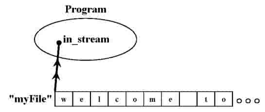
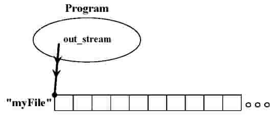

### 6.3. 文件操作
> 当通过以上的方式创建过文件流后，我们就可以通过 `open()` 方法来打开文件了。以下语句将会让 C++ 程序打开一个名为 `myFile.txt` 的文件（假设它与代码文件在相同的目录下），并且将 `in_stream` "连接" 到文件的开头处：
```cpp
in_stream.open("myFile.txt")
```

> 一旦连接后，我们的程序就能够读取文件中的内容了：
>
> 

> `ofstream` 也有同名的 `open()` 方法，但其定义要与用于读取文件的 `ifstream` 有所不同：
```cpp
out_stream.open("anotherFile.txt")
```

> 形象地说，我们通过程序中的 `ofstream` 方法开设了一条由文件内流向外部程序的数据管道：
>
> 

> 以上的 `out_stream` 由 `ofstream` 声明。当你使用它尝试连接文件时，它会有两种行为：若文件不存在，它会自动根据给定的文件名创建；若文件已存在，它会清除已有文件内中的所有内容，然后以随后写的内容替换之。

> 若想要断开已打开用于读取 (`ifstream`) 的文件，使用成员方法 `close()`：
```cpp
in_stream.close();
```

> 若想要断开已打开用于写入内容 (`ifstream`) 的文件，我们同样使用方法 `close()`，另外它还会在文件末尾处加上一个用于代表文件末尾的标志。
```cpp
out_stream.close();
```

> 假设你要向一个含有重要内容的文件添加内容，`ofstream` 是正确的选择吗？（单选）
>
> 1. 合适，我们必须使用 `ofstream` 才能编辑文件
> 2. 合适，若不先用 `ofstream` 方法，`ifstream` 会清空文件内容
> 3. 不合适，将 `ofstream` 用在有内容的文件上会清空文件内容
> 4. 不合适，`ofstream` 专用于读文件


