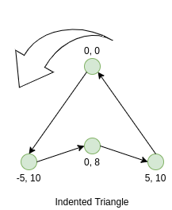

### 8.5. 几何、形状与印章
> *C-Turtle* 里的每个海龟形状都是由一系列坐标组成的。我们可以既可以从默认的四个中选用（即 `triangle`，`indented_triangle`，`square` 和 `arrow`），也可以使用自定义的形状。

> 如何选用 `square` 形状：
```cpp
turtle.shape("square");
```

> 所有基础的形状都是由坐标组成的，默认的形状也是如此。多边形，不管是自定义还是默认的，其点的顺序都必须是逆时针方向才能正常显示。这是由于平面填充背后的数学原理以及计算机图形学中的限制所导致。<u>?请考虑下表中的点的顺序，以及它们如何被视为 "逆时针"。它们是按从上到下的顺序排列的，每个形状的第一个最后一个点之间存在一条边。请注意，正Y坐标在屏幕上比较低，而负Y坐标在屏幕上比较高。</u>座标中心的 `0x, 0y` 即为 *turtle* 的 *点*，多数默认形状也是由此为开端的。
>
| `triangle` | `indented_triangle` | `square`  | `arrow`    |
| :--------- | :------------------ | :-------- | :--------- |
| `(0, 0)`   | `(0, 0)`            | `(-5, 5)` | `(0, 0)`   |
| `(-5, 5)`  | `(-5, 10)`          | `(-5, 5)` | `(-5, 5)`  |
| `(5, 5)`   | `(0, 8)`            | `(5, 5)`  | `(-3, 5)`  |
| \          | `(5, 10)`           | `(5, 10)` | `(-3, 10)` |
| \          | \                   | \         | `(3, 10)`  |
| \          | \                   | \         | `(3, 5)`   |
| \          | \                   | \         | `(5, 5)`   |

> 以默认的 `indented_triangle` 形状为例，此为逆时针方向的实际性质。
    >> 

> 以下我们演示了如何创建你自己的海龟形状。我们主要使用 `Polygon` 类来表示我们的形状。在此例中我们将默认的 `triangle` 改为倒立的三角形。
```cpp
ct::Polygon upside_down_triangle = {
    {0, 0},     // 第一个点
    {-5, -5},   // 第二个点
    {5, -5},    // 等等
}
```

> 以下是一个自定义形状的完整示例。随便改改吧，也许最终的形状会惊讶到你呢！
```cpp
#include <CTurtle.hpp>
namespace ct = cturtle;

int main(){
    ct::TurtleScreen screen;

    screen.tracer(1, 1000);
    ct::Turtle turtle(screen);

    ct::Polygon upside_down_triangle = {
        {0, 0},     // 第一个点
        {-5, -5},   // 第二个点
        {5, -5},    // 等等
    };

    turtle.shape(upside_down_triangle);
    turtle.forward(50);

    screen.bye();

    return 0;
}
```

> 印章 <small>(Stamps)</small> 能够让 *turtle* 在画板上留下自己的多个副本但无需追踪每一个形状。它可用于各种视觉效果，但一般情况下我们主要利用它来节省时间。印章可由 `stamp` 方法来在特定位置刻印，每次执行完毕后它会返回一个类似 *印章 ID* 的整数值。如果你想要清除印章的话，你有两个选择：`clearstamp` 和 `clearstamps`，前者清除单个印章，后者为多个（若不指定数值即为全部）。

> 以下程序示例了如何将自定义形状和印章放在一起使用。
```cpp
#include <CTurtle.hpp>
namespace ct = cturtle;

int main(){
    ct::TurtleScreen screen;

    screen.tracer(1, 1000);
    ct::Turtle turtle(screen);

    ct::Polygon upside_down_triangle = {
        {0, 0},     // 第一个点
        {-5, -5},   // 第二个点
        {5, -5},    // 以下省略
    };

    turtle.shape(upside_down_triangle);

    //Draw a square where each edge is 50 units long.
    for(int i = 0; i < 4; i++){

        // 在角落处放置印章
        int corner_stamp = turtle.stamp();

        turtle.forward(25);
        turtle.stamp();  // 在每一边的正中心刻印
        turtle.forward(25);

        turtle.right(90);

        // 清除角落的印章
        turtle.clearstamp(corner_stamp);
    }

    turtle.clearstamps();

    screen.bye();
    return 0;
}
```
